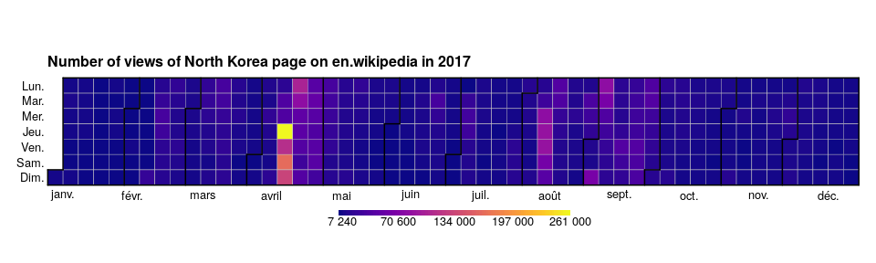

YACH - Yet Another Calandar Heatmap
================

Install
-------

``` r
require(devtools)
install_github("rCarto/yach")
```

Example
-------

``` r
library(yach)
data(wiki)
cols <- c("#0D0887FF", "#2D0594FF", "#44039EFF", "#5901A5FF", "#6F00A8FF", 
          "#8305A7FF", "#9512A1FF", "#A72197FF", "#B6308BFF", "#C5407EFF", 
          "#D14E72FF", "#DD5E66FF", "#E76E5BFF", "#EF7F4FFF", "#F79044FF", 
          "#FBA238FF", "#FEB72DFF", "#FDCB26FF", "#F7E225FF", "#F0F921FF")
calendarHeat(dates = wiki$date, values = wiki$views, colors = cols, 
             title = "Number of views of North Korea page on en.wikipedia in 2017")
```


