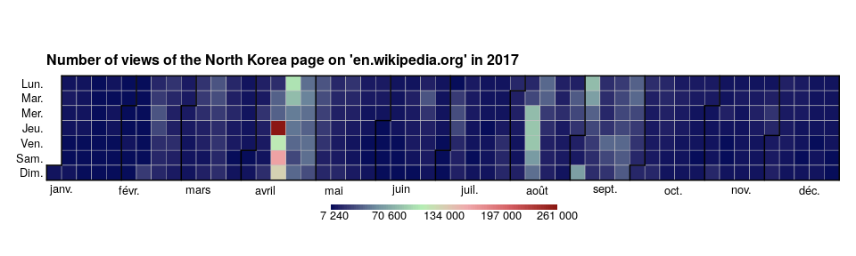

yach - Yet Another Calandar Heatmap
================

## Install

``` r
devtools::install_github("rCarto/yach")
```

## Example

``` r
library(yach)
data(wiki)
calendarHeat(dates = wiki$date, values = wiki$views,
             title = "Number of views of the North Korea page on 'en.wikipedia.org' in 2017")
```

<!-- -->

**Inspiration**: [Calendar Heatmap by Paul
Bleicher](https://github.com/iascchen/VisHealth/blob/master/R/calendarHeat.R)
